# LocalBiz Connect
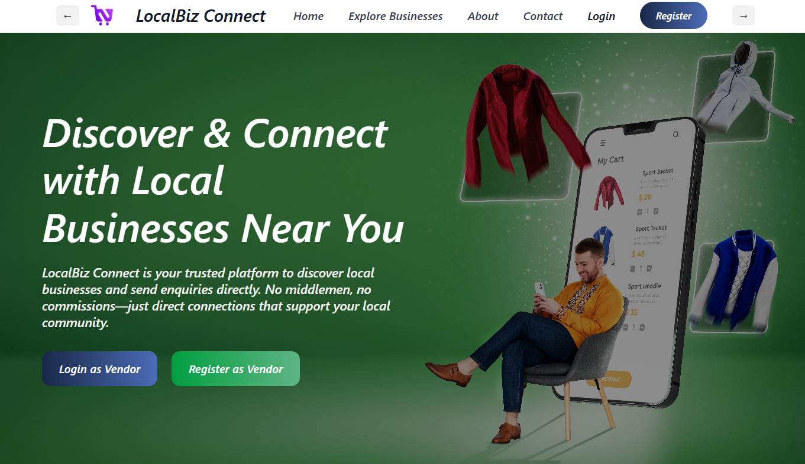


# Introduction
LocalBiz Connect is a full-stack marketplace web application developed to connect customers with local vendors through a modern digital platform. The application allows customers to explore products, place orders, track order status, and communicate directly with vendors. Vendors can manage products, inventory, customer orders, and account settings through a dedicated dashboard, while administrators can monitor overall platform activity using an analytics-based admin panel.


## 🚀 Features

### 👤 Customer Module
- Customer Signup & Login
- Product Exploration
- Search & Category Filtering
- Search & Category Filtering
- Place Product Inquiries/Orders and  Customer-Vendor Chat
- Profile Management


### 🛍 Vendor Module
- Vendor Registration & Login
-Vendor Dashboard
-Adding Products
-Update / Delete Products
- Inventory Management
- Order Management, - Accept / Reject Order
- Account Settings Dashboard


  ### 🛠 Admin Module
- Vendor Management
- Customer Management
- Product Moderation
- Order Monitoring
- Analytics Dashboard

--------------------------------------------------

## 💻 Tech Stack

| Technology | Purpose |
|------------|---------|
| React.js | Frontend Development |
| Node.js | Backend Runtime |
| Express.js | API Development |
| MySQL | Database |
| Chart.js | Analytics Visualization |
| bcrypt | Password Security |
- bcrypt
- cors
- body-parser


## Screenshots

- 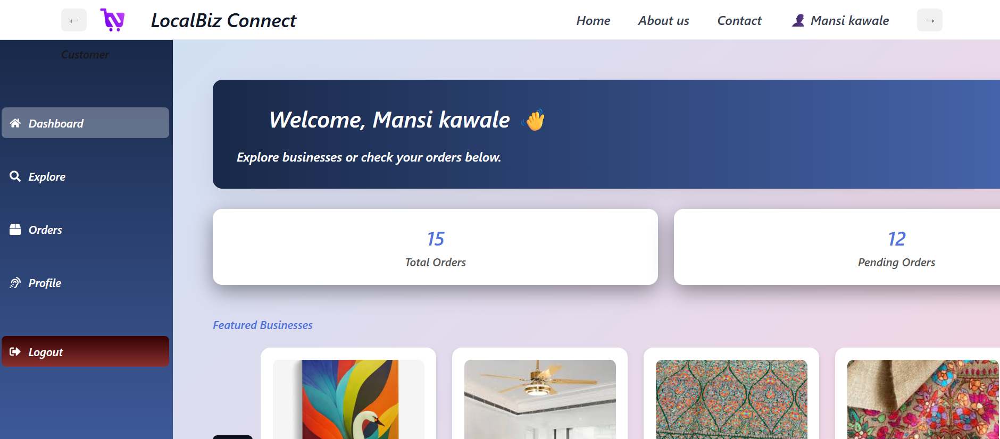

- 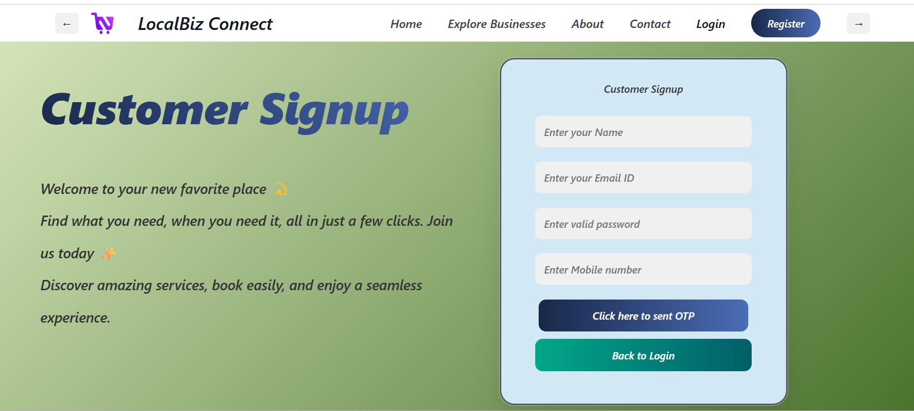

- 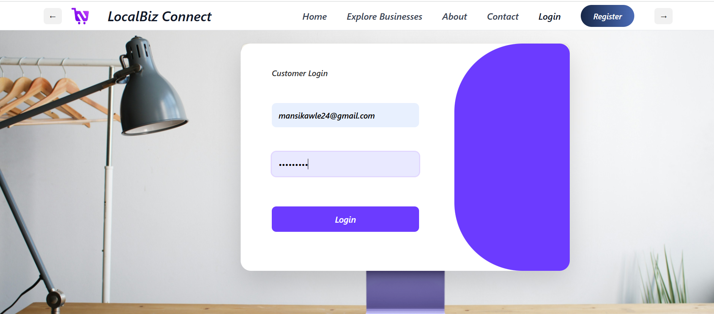

- 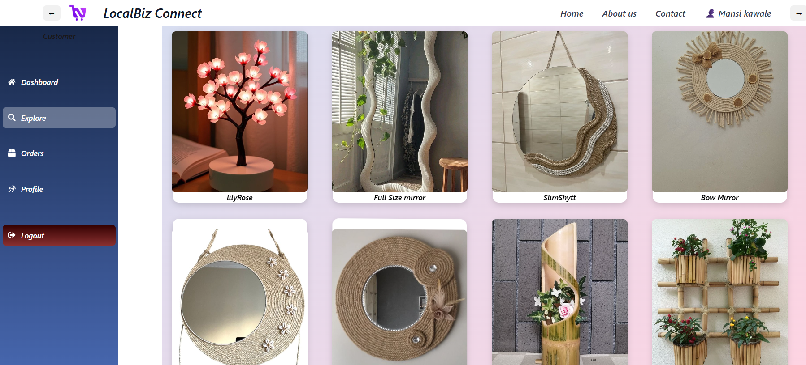

- 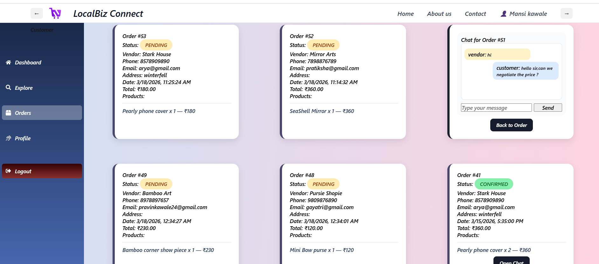

- 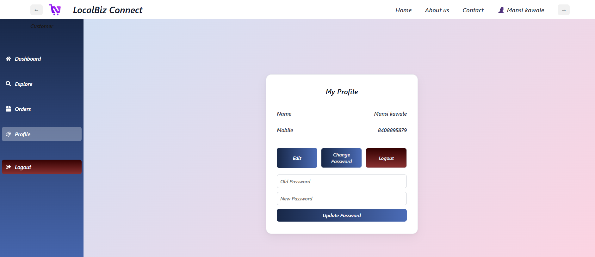
 

- 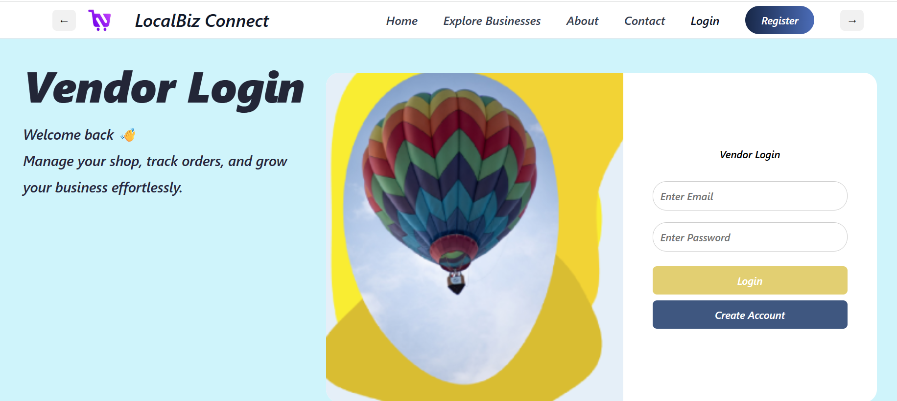

- 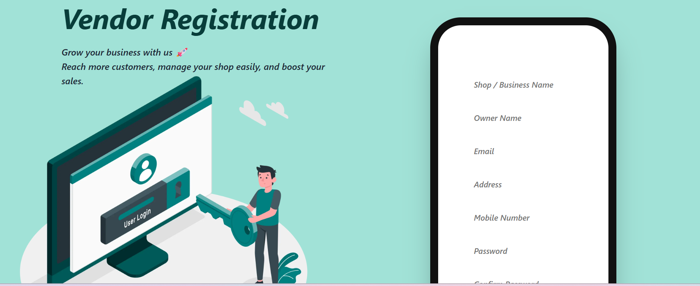

- 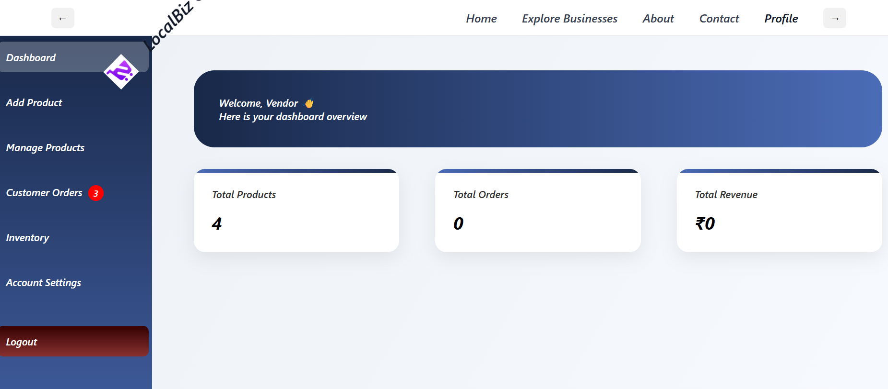
 
- 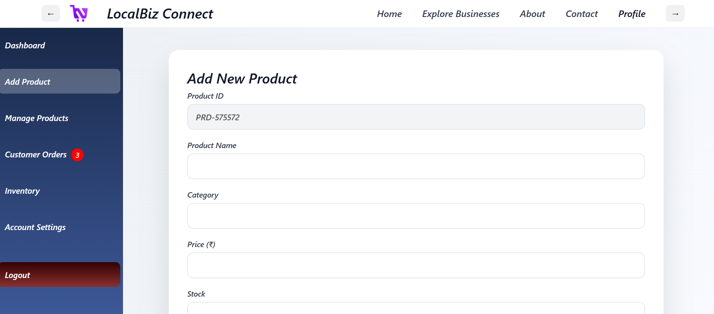

- 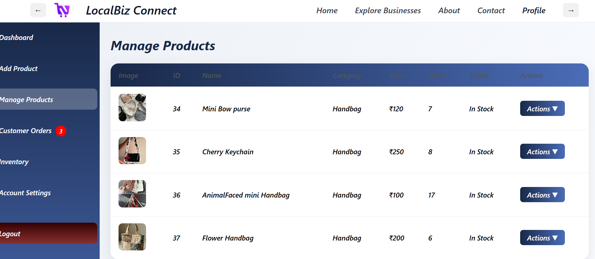

- 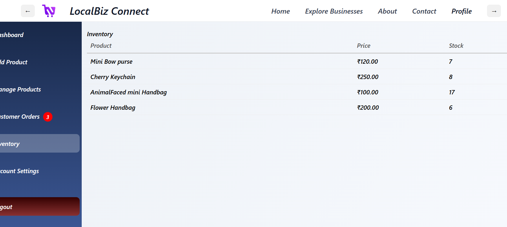

- 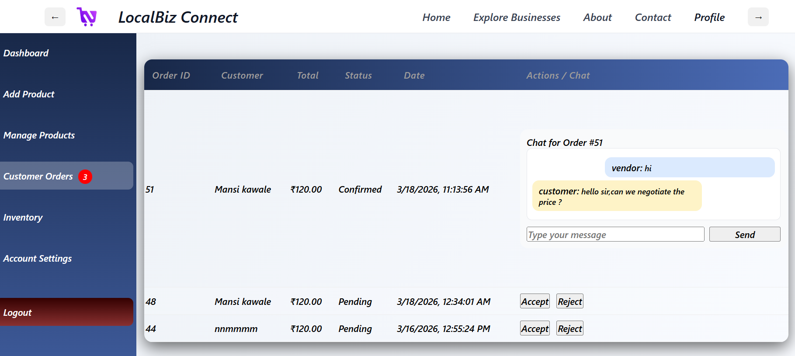

- 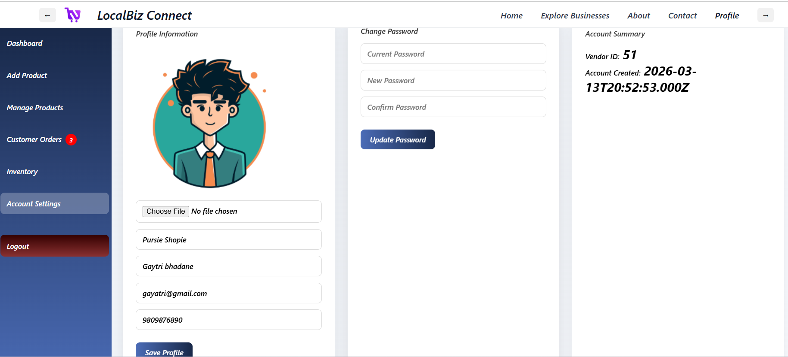


- 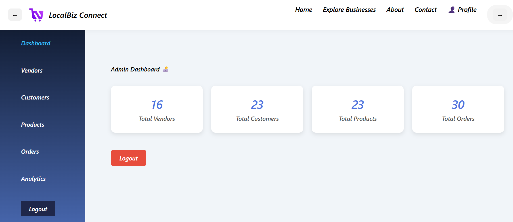

- 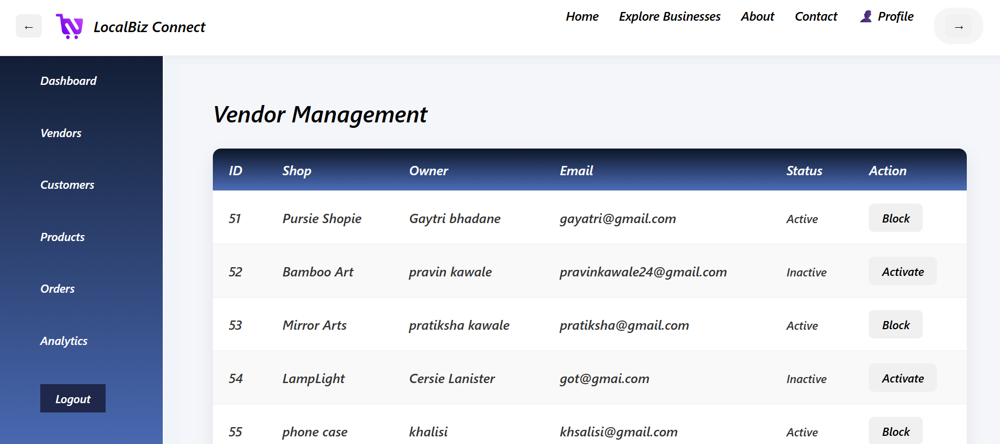

- 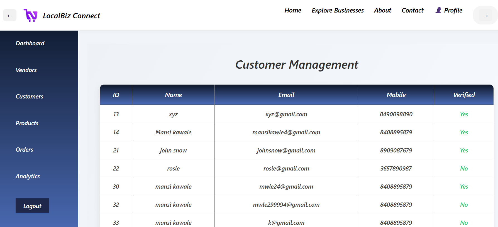

- 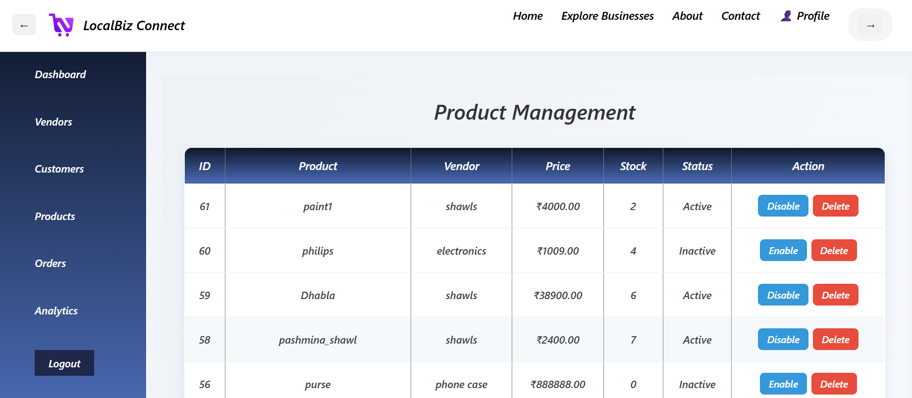

- 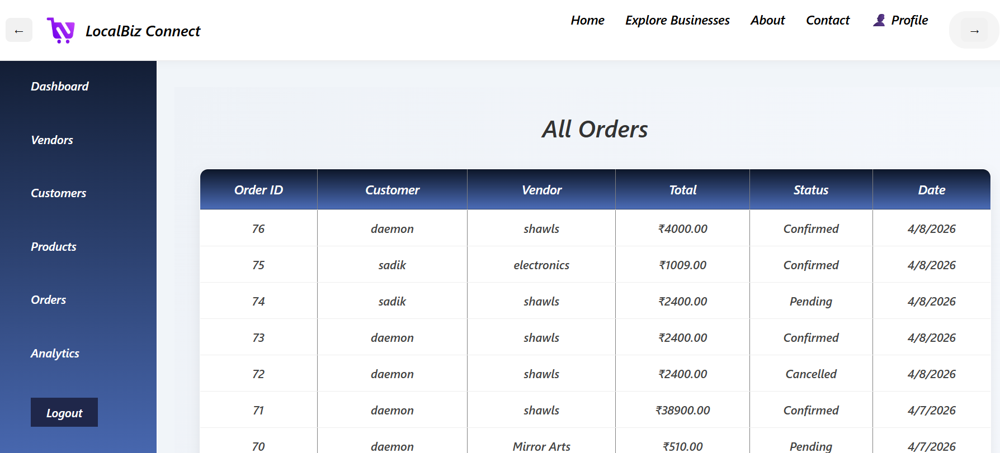

- 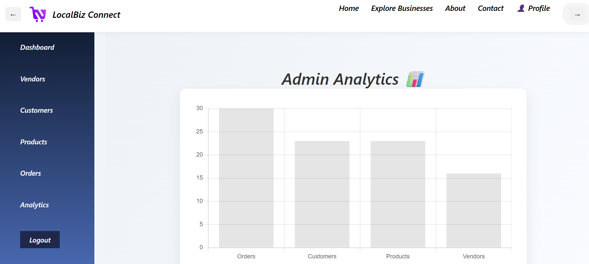
  

## Project Structure

```txt
LOCALBIZZ_CONNECT/
├── Backend/
│   ├── node_modules/          # Backend dependencies
│   ├── admin.js               # Admin-related backend logic
│   ├── db.js                  # Database connection setup
│   ├── db.sql                 # MySQL database schema
│   ├── VendorRouts.js         # Vendor API routes
│   ├── server.js              # Main backend server
│   ├── servers.js             # Additional server configuration
│   ├── package.json           # Backend dependencies & scripts
│   └── package-lock.json
│
├── react-frontend/
│   ├── public/                # Public assets
│   ├── src/
│   │   ├── assets/            # Images & static files
│   │   ├── components/        # React components
│   │   │   ├── AdminDashboard.jsx
│   │   │   ├── AdminProducts.jsx
│   │   │   ├── CustomerDashboard.jsx
│   │   │   ├── CustomerOrders.jsx
│   │   │   ├── VendorDashboard.jsx
│   │   │   ├── VendorOrders.jsx
│   │   │   ├── Login.jsx
│   │   │   ├── Signup.jsx
│   │   │   ├── Navbar.jsx
│   │   │   ├── Sidebar components
│   │   │   └── Product management modules
│   │   │
│   │   ├── App.jsx            # Main React app component
│   │   ├── main.jsx           # React entry point
│   │   ├── App.css
│   │   └── index.css
│   │
│   ├── index.html
│   ├── vite.config.js         # Vite configuration
│   ├── eslint.config.js       # ESLint configuration
│   ├── vercel.json            # Vercel deployment config
│   ├── package.json
│   ├── package-lock.json
│   └── README.md
│
├── .gitignore                 # Ignored files & folders
└── README.md                  # Project documentation
```
------------------------------------------------------------------------------------------

## ⚙️ Installation & Setup

### 📌 Prerequisites
Make sure the following are installed on your system:

- Node.js
- npm
- MySQL
- Git

--------------------------_---

## 📦 Dependencies

### Frontend
- React.js
- React Router DOM
- React Icons
- Chart.js
- React ChartJS 2

### Backend
- Express.js
- MySQL2
- bcrypt
- body-parser
- cors

### Tools & Utilities
- npm
- Git
- Vite

### 1️⃣ Clone the Repository

```bash
git clone https://https://github.com/mansi153-wq/LocalBizz_connect.git
cd LocalBiz-Connect

2️⃣ Install Frontend Dependencies
cd frontend
npm install

3️⃣ Install Backend Dependencies
cd backend
npm install

4️⃣ Configure MySQL Database

Create a MySQL database named:
simple_login
Update database credentials inside:
backend/database.js

5️⃣ Start Servers

Start Frontend

Open a new terminal:
1)Terminal 1
cd frontend
npm run dev

Frontend runs on:
http://localhost:5173

Start Backend Server


2)Terminal 2:
cd backend
node server.js

3)Terminal 3:
cd backend
node servers.js

Backend runs on :
http://localhost:5000
http://localhost:5000


## 📊 Key Functionalities

- Full-stack marketplace platform with Customer, Vendor, and Admin modules  
- Secure authentication and role-based access control  
- Product management with add, update, delete, and inventory tracking features  
- Order placement, status updates, and order management system  
- Customer-vendor communication through integrated chat functionality  
- Search and category-based product filtering  
- Admin dashboard with analytics and graphical data visualization  
- REST API integration using Express.js and MySQL  
- CRUD operations for products, users, vendors, and orders  
- Responsive dashboard interfaces for different user roles  
- Real-time data handling and dynamic UI rendering using React.js  
- Password encryption and security implementation using bcrypt


